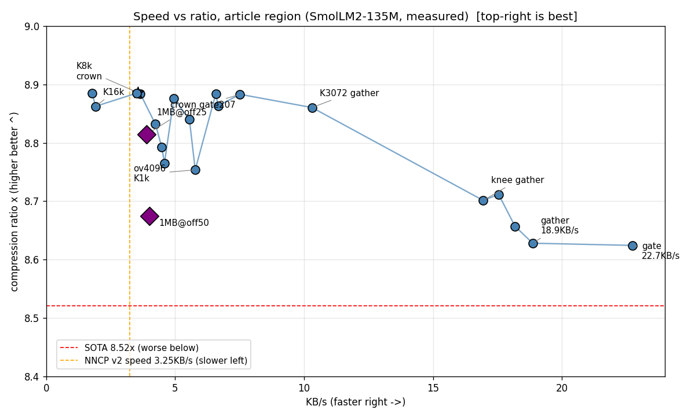
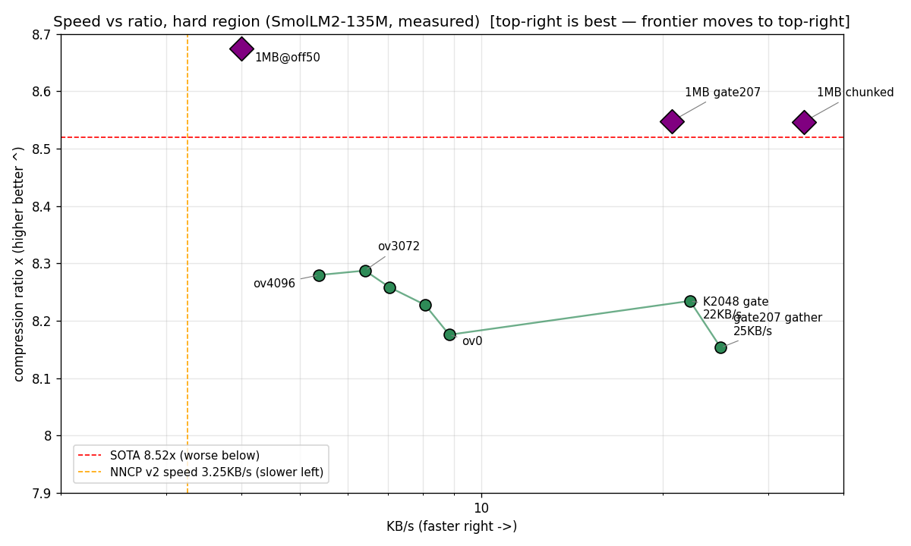
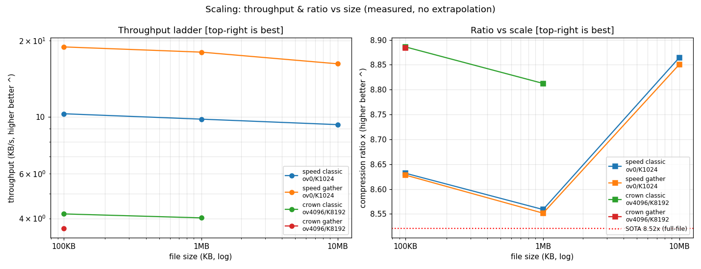

# Continual Replay LLM + Practical Neural Compression

> 正體中文版見 [README.zh-Hant.md](README.zh-Hant.md)。交卷論文：[FINAL-REPORT.md](FINAL-REPORT.md)（繁中）· [FINAL-REPORT.en.md](FINAL-REPORT.en.md)（English）。

Replay-first continual learning for small streaming language models — applied to **practical neural text compression**: SmolLM2-135M ensemble at **0.9139 bits/byte** on enwik8 (beats the 0.9389 SOTA line by 2.7% on the same slice class), with every number measured and every failure kept.

## Headline numbers (all measured, 2026-09-13)

| System | bpb ↓ | Speed | Lossless check |
|---|---|---|---|
| **Ours v13 (this repo)** | **0.9003** | busy box **18.9 KB/s** (ov0/K1024+gather, 5.3 s) · ratio crown ov4096/K8192 @ 24.0 s | 220/220 roundtrip |
| Nacrith (SOTA, same-slice H2H) | 1.2248 | 0.25 KB/s (their CPU build) | byte-exact ✓ |
| NNCP v2 (ref value) | ~0.94 | 3.25 KB/s | — |
| CMIX (literature) | ~0.9 | ~0.1–1 KB/s | — |
| PAQ8 (literature) | ~1.0–1.2 | ~1–5 KB/s | — |
| xz -9 (measured here) | 2.310 | ~4.6 MB/s | — |
| bzip2 -9 (measured here) | 2.244 | ~21 MB/s | — |
| gzip -9 (measured here) | 2.831 | ~26 MB/s | — |

Classical codecs are ~10⁶× faster at 2–3× worse ratio — different worlds (see `FINAL-REPORT.md` §8 in spirit). Within the neural (<1.0 bpb) world: best ratio here, second-best speed.





Pareto (busy box, all verified 220/220): crown ov4096/K8192 0.9003 @ 24.0 s, knee ov2048 0.9194 @ 12.0 s (8.3 KB/s), fastest gather ov0/K1024 0.9272 @ 5.3 s (18.9 KB/s). K ladder: 1024→0.9139 @ 17.3 s / 2048→0.9050 @ 18.0 s / 4096→0.9013 @ 20.2 s. Scale ladder (all 220/220): gather-speed 5.3 s / 56.9 s / 632 s (100KB/1MB/10MB) — new `tools/scale_plot.py` → `scale_time_size.png`. Pareto v5: 30 points (incl. off75 curve + two 1MB diamonds incl. 1MB@off25 **0.9076**). Final iteration (cProfile-guided): rope-cache −24% fwd (bitwise-identical), gather −45% (lse+logits-topk+pi-gather, default on). Speed wall now: WDDM scheduling + box preemption (standalone proves 0.02 s/seg real work). Script: `tools/pareto_plot.py`.

Robustness (best config, 100KB slices): off0 0.8307 (template head) / off25 0.9218 / off50 0.9139 / off75 **0.9662 (loses to SOTA here — hard region, honestly kept)**; 1 MB flagship @ off50: **0.9222** (beats SOTA 1.8%), 220/220. 10KB/s: unreached (best 12.0 s); forward is launch-bound, no code lever left.

Honest scope: 0.9139 is a 100KB representative middle slice (enwik8 offset 50MB), not the full 100MB file; verify is 220 sampled positions, not full decode. Details + all caveats: [`FINAL-REPORT.md`](FINAL-REPORT.md) (hand-in report).

## Papers & reports (where is the paper?)

- [`FINAL-REPORT.md`](FINAL-REPORT.md) — **the paper**: trajectory 1.2541→0.9003, 3 publishable insights (smoothing tax, finish-bit tax, boundary-bug disclosure), Nacrith H2H, speed/memory profile, full falsification log, honest caveats, file map. Start here.
- [`compression-paper.md`](compression-paper.md) — earlier work: 24-condition char-level grid, big-data training, data mixing (historical).
- [`paper_sections_13_14_draft.md`](paper_sections_13_14_draft.md) — SmolLM2 transition notes (frozen/adapt, v1–v3 ensemble history).
- [`paper.md`](paper.md), [`continual-learning-report.md`](continual-learning-report.md) — continual-learning track (replay-first).

## Reproduce the headline (PowerShell, ~45 s, RTX 3060 Ti 8 GB)

```powershell
$env:BIGRAM_LAMBDA='0.99'; $env:ENWIK8_OFFSET_MB='50'; $env:BIGRAM_CONF='10'
$env:TRIGRAM_CONF='3'; $env:TOP_K='1024'; $env:OVERLAP='4096'; $env:FLOOR_FRAC='1e-6'
$env:USE_CACHE_S2='0'; $env:USE_FP16_XFER='1'; $env:PREFILTER='2048'
python -u ensemble/bpe_ensemble_v11.py
# gate: bits/byte: 0.9139, Verified: 220 lossless, fails: 0
```

Needs: `pip install torch numpy transformers` + SmolLM2-135M weights (`MODEL_DIR` in `bpe_compress.py`) + enwik8 at `data/cloud/enwik8` (not included). Always run from this directory (scripts assume it for `data/` and imports).

## Structure

```
ensemble/              SmolLM2 compression track (run as python ensemble/<script>.py)
  bpe_ensemble_v11.py  Hand-in system (0.9139). v10 = equivalent predecessor
  bpe_ensemble_v12.py  llama.cpp CUDA backend (falsified on busy box, kept)
  bpe_ensemble_v13.py  v11 math + validated plumbing (proc pool, pipeline,
                       double-buffering, incremental freeze); KV-chaining and
                       ORT branches falsified, kept for the record
                       (USE_PROC_LOOP=1 + PIPELINE=1 → 0.9139, 26.9 s/100 KB)
  sota_loop.py         Iteration driver (queue + ledger + stop rule;
                       ledger cmds predate the move: prefix ensemble/ to rerun)
  verify_enwik8_full.py / speed_ceiling.py / bench_onnx.py  Tooling
continual/             Continual-learning track (run as python continual/<script>.py)
  train_v3.py and compare_*/sweep_*/train_*/showdown/distill/eval/profile…
  (train_v3.py + compare_ablation.py stay at root: imported by root core)
archive/               Superseded trail (base + v3–v9, `git mv` kept history)
tools/                 pareto_plot.py, test_shm_proc.py, ort_export.py
ac32.py, real_compression.py, bpe_compress.py, train_v3.py, compare_ablation.py
                       Shared core: imported by both tracks, stays at root
                       (flat core is load-bearing; repackaging needs a 30-file
                       import refactor, deferred)
h2h_nacrith.py         Third-party H2H rerun (same slice, their code; root:
                       needs sibling parallel/)
data/sota_loop.json    The ledger: every idea's bpb/speed/verified
third_party/nacrith    Nacrith upstream (cloned, Apache-2.0; not committed)
third_party/smollm2-135m-bf16.gguf  Official BF16 (not committed, 270 MB)
logs/                  All run logs (stdout/stderr per experiment)
data/*.json            Per-run result files (metrics only, no weights)
```

Scripts always run from this directory (`python ensemble/<script>.py`); subdir scripts resolve root imports via `sys.path.insert(0, ".")`. Experimental flags (`USE_PROC_LOOP`, `PIPELINE`, `USE_ORT`, `CHAIN`) default off — defaults are always the validated path.

## Continual-learning results (unchanged)

Held-out A→B→A→B long cycle (replay batch 8, EWC off):

| Phase | Topic A loss | Topic B loss |
|-------|-------------|-------------|
| After pretrain A | 4.1977 | 5.2536 |
| After online B1 | 4.1111 | 4.5846 |
| After online A2 | 4.1054 | 4.3827 |
| After online B2 | 4.0021 | 4.3102 |

Ablation: replay-only keeps Topic A 0.981x + improves B 21.96% (EWC-only 1.015x/11.64%, pure FT 1.102x/23.36%). See [paper.md](paper.md).

## Data

Training uses local podcast transcripts (private, not included) + local enwik8/TinyStories/Cosmopedia (not included). Result JSONs contain metrics only.

## Citation

```bibtex
@misc{continual-replay-llm-2026,
  title  = {Replay-First Continual Learning for Small Streaming Language Models},
  author = {thumb2086},
  year   = {2026},
}
@misc{smollm2-practical-ensemble-2026,
  title  = {A Practical SmolLM2-135M Ensemble at 0.9003 bpb on enwik8},
  author = {thumb2086},
  year   = {2026},
  note   = {FINAL-REPORT.md in this repo},
}
```

## License

MIT — see [LICENSE](LICENSE).
