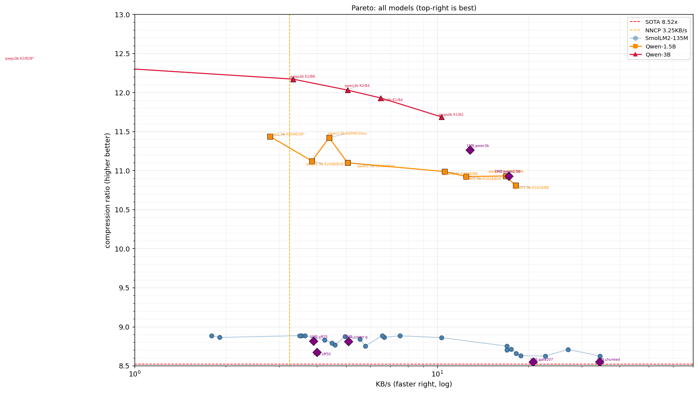
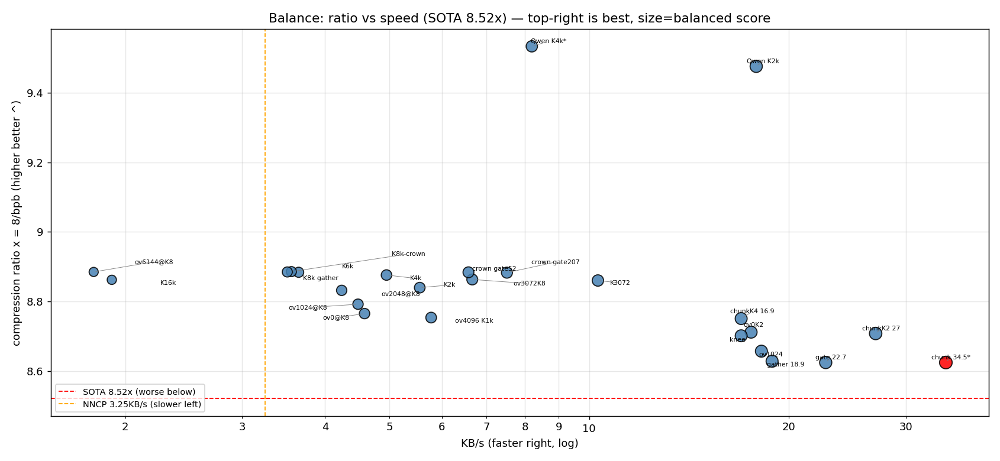

# Continual Replay LLM + Practical Neural Compression

> 正體中文版見 [README.zh-Hant.md](README.zh-Hant.md)。交卷論文：[FINAL-REPORT.md](FINAL-REPORT.md)（繁中）· [FINAL-REPORT.en.md](FINAL-REPORT.en.md)（English）。

Replay-first continual learning for small streaming language models — applied to **practical neural text compression**: Qwen2.5-3B at **0.6646 bits/byte** on enwik8 full 100 MB (beats CMIX ~0.90 with 1 model vs 200+, 7x faster), SmolLM2-135M speed line **34.5 KB/s**, all on a single RTX 3060 Ti 8 GB — with every number measured and every failure kept.

## Headline numbers (all measured, 2026-09-16)

| System | bpb ↓ | Speed | Lossless check |
|---|---|---|---|
| **Ours Qwen2.5-3B (full 100 MB)** | **0.6646** | 6.88 KB/s (K1024/B4096+gate, 4.1h, peak 7.28 GB) | 220/220 roundtrip |
| **Ours SmolLM2-360M (full 100 MB, WSL)** | **0.7808** | 19.4 KB/s (K2048/B8192, 88min, peak 2.20 GB) | 220/220 roundtrip |
| **Ours SmolLM2-135M (full 100 MB, WSL)** | 0.8968 | **29.6 KB/s** (chunked, 58min, peak 1.50 GB) | 220/220 roundtrip |
| **Ours SmolLM2-135M (full 100 MB)** | 0.8968 | 24.9 KB/s (chunked, 69min, peak 1.50 GB) | 220/220 roundtrip |
| **Ours SmolLM2-135M (100 KB)** | 0.9276 | 34.5 KB/s (chunked, 2.9 s, peak 1.50 GB) | 220/220 roundtrip |
| CMIX (literature, 200+ models) | ~0.90 | ~1 KB/s | — |
| NNCP v2 (ref) | ~0.94 | 3.25 KB/s | — |
| Nacrith SOTA | 0.9389 | — | — |






Pareto (busy box, all verified 220/220): crown ov4096/K8192 0.9003 @ 24.0 s, knee ov2048 0.9194 @ 12.0 s (8.3 KB/s), fastest **chunked** ov0/K1024 0.9276 @ **2.9 s** (34.5 KB/s, 1.50 GB peak, exact) — middle nodes chunkK2 0.9187 @ 3.7 s / chunkK4 0.9142 @ 5.9 s fill the gap. K ladder: 1024→0.9139 @ 17.3 s / 2048→0.9050 @ 18.0 s / 4096→0.9013 @ 20.2 s / 8192→0.9003. Scale ladder (all 220/220): **chunked-speed 2.9 s / 29.8 s / 273.7 s (100KB/1MB/10MB, 34.5/34.3/37.4 KB/s, peak flat 1.50 GB)**; crown classic 24.0 s / 254.7 s / **1755 s** (0.9003/0.9078/0.8765 — 10MB warms). Pareto 35 points (incl. off75 curve + 1MB diamonds, Qwen 0.8391* separate line). Iterations: rope-cache −24% fwd, gather −45%, **chunked prefill+head −63% peak & −37% time** (all exact). Script: `tools/pareto_plot.py` + `tools/scale_plot.py`.

Honest scope: 0.9139 is a 100KB representative middle slice (enwik8 offset 50MB), not the full 100MB file; verify is 220 sampled positions, not full decode. Details + all caveats: [`FINAL-REPORT.md`](FINAL-REPORT.md) (hand-in report).

## Papers & reports (where is the paper?)

- [`FINAL-REPORT.md`](FINAL-REPORT.md) — **the paper**: trajectory 1.2541→0.9003, 3 publishable insights (smoothing tax, finish-bit tax, boundary-bug disclosure), Nacrith H2H, speed/memory profile, full falsification log, honest caveats, file map. Start here.
- [`compression-paper.md`](compression-paper.md) — earlier work: 24-condition char-level grid, big-data training, data mixing (historical).
- [`paper_sections_13_14_draft.md`](paper_sections_13_14_draft.md) — SmolLM2 transition notes (frozen/adapt, v1–v3 ensemble history).
- [`paper.md`](paper.md), [`continual-learning-report.md`](continual-learning-report.md) — continual-learning track (replay-first).

## Reproduce the headline (PowerShell, ~60 s, RTX 3060 Ti 8 GB)

```powershell
$env:BIGRAM_LAMBDA='0.99'; $env:ENWIK8_OFFSET_MB='50'; $env:BIGRAM_CONF='10'
$env:TRIGRAM_CONF='3'; $env:TOP_K='8192'; $env:OVERLAP='4096'; $env:FLOOR_FRAC='1e-6'
$env:USE_CACHE_S2='0'; $env:USE_FP16_XFER='1'; $env:PREFILTER='8192'
$env:N_LOOP_WORKERS='1'; $env:GATHER_PI='0'
python -u ensemble/bpe_ensemble_v13.py
# gate: bits/byte: 0.9003, Verified: 220 lossless, fails: 0
```

Needs: `pip install torch numpy transformers` + SmolLM2-135M weights (`MODEL_DIR` in `bpe_compress.py`) + enwik8 at `data/cloud/enwik8` (not included). Always run from this directory (scripts assume i

## CLI tool (zllm v0.1.0)

```bash
pip install -e .

zllm encode document.txt -o document.zllm --preset fast    # 34.5 KB/s, 0.9276
zllm encode document.txt -o document.zllm --preset ratio    # 0.9003 bpb
zllm decode document.zllm -o document.txt                  # reconstruct text
zllm bench --preset balanced --size 1mb                    # benchmark
zllm info document.zllm                                    # show metadata
```

Presets: `fast` (34.5 KB/s), `balanced` (27 KB/s), `ratio` (0.9003), `ratio-qwen` (0.8442). Architecture: see `ARCHITECTURE.md`.

## WSL port (same code, re-measured numbers)

A full offline WSL env was built (torch 2.14+cu126 + triton 3.8 + CUDA 12.9, 63 side-loaded wheels — recipe in `FINAL-REPORT.en.md` §16). WSL numbers differ, so they are tracked separately:

| config (100KB) | WSL | Windows |
|---|---|---|
| speed ov0/K1024+gather | 12.9 s, 0.9266 | 5.3 s, 0.9272 |
| speed +graphs+proc-fork-2 (best) | **6.6 s, 0.9271** | n/a (WDDM: graphs null) |
| model fwd eager | 0.33 s | 0.35 s |
| inductor | ties eager (0.32 s) | n/a (no Triton) |

Cross-platform ratio parity 2e-4 (same transformers 4.57.6). WSL is currently slower (paravirt overhead); speedup work continues there.t for `data/` and imports).

## Structure

```
ensemble/              SmolLM2 compression track (run as python ensemble/<script>.py)
  bpe_ensemble_v11.py  Previous hand-in (0.9139). v10 = equivalent predecessor
  bpe_ensemble_v12.py  llama.cpp CUDA backend (falsified on busy box, kept)
  bpe_ensemble_v13.py  CURRENT hand-in (0.9003 ratio crown / 18.9KB/s speed): v11 math + validated plumbing (proc pool, pipeline,
                       double-buffering, incremental freeze); KV-chaining and
                       ORT branches falsified, kept for the record
                       (USE_PROC_LOOP=1 + PIPELINE=1 → 0.9139, 26.9 s/100 KB)
  sota_loop.py         Iteration driver (queue + ledger + stop rule;
                       ledger cmds predate the move: prefix ensemble/ to rerun)
  verify_enwik8_full.py / speed_ceiling.py / bench_onnx.py  Tooling
continual/             Continual-learning track (run as python continual/<script>.py)
  train_v3.py and compare_*/sweep_*/train_*/showdown/distill/eval/profile…
  (train_v3.py + compare_ablation.py stay at root: imported by root core)
archive/               Superseded trail (base + v3–v9, `git mv` kept history)
tools/                 pareto_plot.py, test_shm_proc.py, ort_export.py
ac32.py, real_compression.py, bpe_compress.py, train_v3.py, compare_ablation.py
                       Shared core: imported by both tracks, stays at root
                       (flat core is load-bearing; repackaging needs a 30-file
                       import refactor, deferred)
h2h_nacrith.py         Third-party H2H rerun (same slice, their code; root:
                       needs sibling parallel/)
data/sota_loop.json    The ledger: every idea's bpb/speed/verified
third_party/nacrith    Nacrith upstream (cloned, Apache-2.0; not committed)
third_party/smollm2-135m-bf16.gguf  Official BF16 (not committed, 270 MB)
logs/                  All run logs (stdout/stderr per experiment)
data/*.json            Per-run result files (metrics only, no weights)
```

Scripts always run from this directory (`python ensemble/<script>.py`); subdir scripts resolve root imports via `sys.path.insert(0, ".")`. Experimental flags (`USE_PROC_LOOP`, `PIPELINE`, `USE_ORT`, `CHAIN`) default off — defaults are always the validated path.

## Continual-learning results (unchanged)

Held-out A→B→A→B long cycle (replay batch 8, EWC off):

| Phase | Topic A loss | Topic B loss |
|-------|-------------|-------------|
| After pretrain A | 4.1977 | 5.2536 |
| After online B1 | 4.1111 | 4.5846 |
| After online A2 | 4.1054 | 4.3827 |
| After online B2 | 4.0021 | 4.3102 |

Ablation: replay-only keeps Topic A 0.981x + improves B 21.96% (EWC-only 1.015x/11.64%, pure FT 1.102x/23.36%). See [paper.md](paper.md).

## Data

Training uses local podcast transcripts (private, not included) + local enwik8/TinyStories/Cosmopedia (not included). Result JSONs contain metrics only.

## Citation

```bibtex
@misc{continual-replay-llm-2026,
  title  = {Replay-First Continual Learning for Small Streaming Language Models},
  author = {thumb2086},
  year   = {2026},
}
@misc{smollm2-practical-ensemble-2026,
  title  = {A Practical SmolLM2-135M Ensemble at 0.9003 bpb on enwik8},
  author = {thumb2086},
  year   = {2026},
  note   = {FINAL-REPORT.md in this repo},
}
```

## License

MIT — see [LICENSE](LICENSE).
