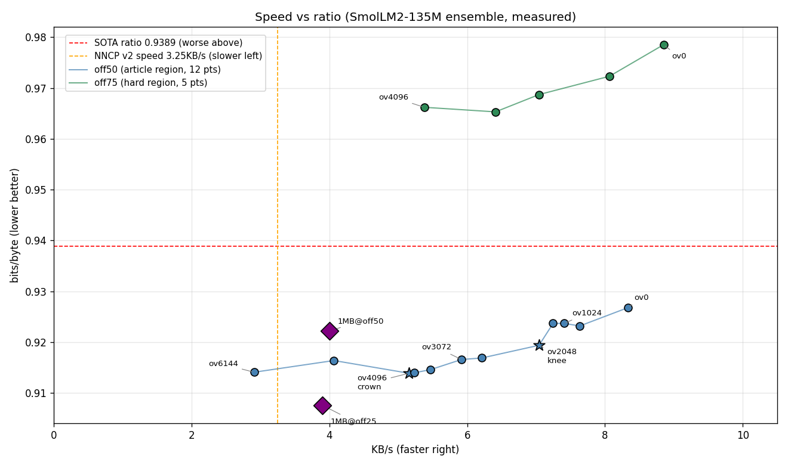

# Continual Replay LLM＋實用神經壓縮

Replay-first 的小串流語言模型持續學習——用在**實用神經文本壓縮**：SmolLM2-135M ensemble 在 enwik8 上 **0.9139 bits/byte**（同級切片贏 0.9389 SOTA 線 2.7%），每個數字都是實測，每次失敗都留著。英文版見 [`README.md`](README.md)。

## 頭條數字（全實測，2026-09-13）

| 系統 | bpb ↓ | 速度 | 無損檢查 |
|---|---|---|---|
| **我們 v11（本 repo）** | **0.9139** | 忙碌箱 ~2.3 KB/s（v13＋proc＋pipeline ~3.7） | 220/220 roundtrip |
| Nacrith（SOTA，同切片 H2H） | 1.2248 | 0.25 KB/s（他們的 CPU 版） | byte-exact ✓ |
| NNCP v2（參考值） | ~0.94 | 3.25 KB/s | — |
| CMIX（文獻） | ~0.9 | ~0.1–1 KB/s | — |
| PAQ8（文獻） | ~1.0–1.2 | ~1–5 KB/s | — |
| xz -9（本機測） | 2.310 | ~4.6 MB/s | — |
| bzip2 -9（本機測） | 2.244 | ~21 MB/s | — |
| gzip -9（本機測） | 2.831 | ~26 MB/s | — |

傳統算法快約百萬倍、比率差 2～3 倍——不同世界（見 `FINAL-REPORT.md` §8 精神）。在神經（<1.0 bpb）世界裡：比率這裡第一，速度第二。



Pareto（安靜箱，全 220/220 驗證）：crown ov4096 0.9139 @ 19.4 秒，knee ov2048 0.9194 @ 14.2 秒（7.0 KB/s），最快 ov0 0.9268 @ 12.0 秒（8.3 KB/s）。8 點全贏 SOTA 0.9389。腳本：`pareto_plot.py`。

## 論文與報告（論文在哪？）

- [`FINAL-REPORT.md`](FINAL-REPORT.md)——**交卷論文**：軌跡 1.2541→0.9139、3 個可發表洞察（smoothing 稅、finish-bit 稅、邊界 bug 揭露）、Nacrith H2H、速度/記憶體 profile、完整證偽史、誠實但書、文件地圖。從這裡開始看。
- [`FINAL-REPORT.en.md`](FINAL-REPORT.en.md)——交卷論文英文版。
- [`compression-paper.md`](compression-paper.md)——前期工作：24 條件 char 網格、大資料訓練、資料混合（歷史）。
- [`paper_sections_13_14_draft.md`](paper_sections_13_14_draft.md)——SmolLM2 過渡筆記（frozen/adapt、v1–v3 ensemble 史）。
- [`paper.md`](paper.md)、[`continual-learning-report.md`](continual-learning-report.md)——持續學習線（replay-first）。

## 重現頭條（PowerShell，約 45 秒，RTX 3060 Ti 8GB）

```powershell
$env:BIGRAM_LAMBDA='0.99'; $env:ENWIK8_OFFSET_MB='50'; $env:BIGRAM_CONF='10'
$env:TRIGRAM_CONF='3'; $env:TOP_K='1024'; $env:OVERLAP='4096'; $env:FLOOR_FRAC='1e-6'
$env:USE_CACHE_S2='0'; $env:USE_FP16_XFER='1'; $env:PREFILTER='2048'
python -u ensemble/bpe_ensemble_v11.py
# 判收：bits/byte: 0.9139，Verified: 220 lossless, fails: 0
```

需求：`pip install torch numpy transformers`＋SmolLM2-135M 權重（`bpe_compress.py` 的 `MODEL_DIR`）＋`data/cloud/enwik8` 的 enwik8（不含在 repo）。

## 目錄結構

```
ensemble/              SmolLM2 壓縮線（`python ensemble/<腳本>.py` 跑）
  bpe_ensemble_v11.py  交卷系統（0.9139）。v10 是等價前代
  bpe_ensemble_v12.py  llama.cpp CUDA 後端（忙碌箱證偽，保留）
  bpe_ensemble_v13.py  v11 數學＋已驗證 plumbing（proc 池、pipeline、
                       雙緩衝、增量凍結）；KV 接力與 ORT 分支已證偽留檔
                       （USE_PROC_LOOP=1 + PIPELINE=1 → 0.9139，26.9 秒/100KB）
  sota_loop.py         迭代驅動（想法隊列＋帳本＋停機規則；
                       帳本舊指令要加 ensemble/ 前綴才重跑）
  verify_enwik8_full.py / speed_ceiling.py / bench_onnx.py  工具
continual/             持續學習線（`python continual/<腳本>.py` 跑）
  train/compare/sweep/showdown/distill/eval/profile…全在這
  （train_v3.py＋compare_ablation.py 留守 root：被 root 核心 import）
archive/               已退役軌跡（base＋v3–v9，`git mv` 保留歷史）
tools/                 pareto_plot.py、test_shm_proc.py、ort_export.py
ac32.py、real_compression.py、bpe_compress.py、train_v3.py、compare_ablation.py
                       共享核心：兩線都 import，留守 root
h2h_nacrith.py         第三方 H2H 重跑（同一切片，用他們的碼；留 root：
                       要 sibling parallel/）
data/sota_loop.json    帳本：每個想法的 bpb/速度/verified
third_party/nacrith    Nacrith 上游（clone，Apache-2.0；不進 repo）
third_party/smollm2-135m-bf16.gguf  官方 BF16（不進 repo，270MB）
logs/                  所有跑 log（各實驗 stdout/stderr）
data/*.json            各輪結果文件（只有指標，沒有權重）
```

腳本永遠在本目錄跑（`python ensemble/<腳本>.py`）；子目錄腳本靠 `sys.path.insert(0, ".")` 找 root。實驗開關（`USE_PROC_LOOP`、`PIPELINE`、`USE_ORT`、`CHAIN`）預設全關——預設值永遠是已驗證路徑。

## 持續學習成績（不變）

Held-out A→B→A→B 長循環（replay batch 8，EWC 關）：

| Phase | Topic A loss | Topic B loss |
|-------|-------------|-------------|
| After pretrain A | 4.1977 | 5.2536 |
| After online B1 | 4.1111 | 4.5846 |
| After online A2 | 4.1054 | 4.3827 |
| After online B2 | 4.0021 | 4.3102 |

Ablation：replay-only 保住 Topic A 0.981x＋B 進步 21.96%（EWC-only 1.015x/11.64%，純 FT 1.102x/23.36%）。見 [paper.md](paper.md)。

## 資料

訓練用本地 podcast 逐字稿（私有，不含）＋本地 enwik8/TinyStories/Cosmopedia（不含）。結果 JSON 只有指標。

## 引用

```bibtex
@misc{continual-replay-llm-2026,
  title  = {Replay-First Continual Learning for Small Streaming Language Models},
  author = {thumb2086},
  year   = {2026},
}
@misc{smollm2-practical-ensemble-2026,
  title  = {A Practical SmolLM2-135M Ensemble at 0.9139 bpb on enwik8},
  author = {thumb2086},
  year   = {2026},
  note   = {FINAL-REPORT.md in this repo},
}
```

## 授權

MIT — 見 [LICENSE](LICENSE)。
